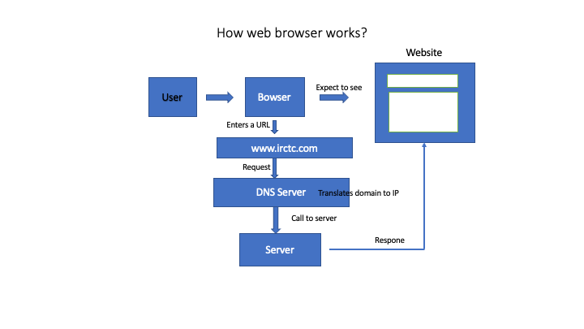

# Web Browser

## How browser browser works:

On very high level. A web browser converts a URL into a web page. Page is whatever is visible on the website.

Let’s a assume a user opens a web browser and he want to visit a particular website and the user knows the correct URL. Assume the user wants to open IRCTC. He enters the IRCTC url and website open in few seconds.

Step involved into rendering a web page.
- The browser does not understands the URL. So browser will call DNS(Domain Name system). A DNS is like a big dictionary(key value pare of URL and IP address.). The DNS will return the respective IP for URL.
- Now the browser will send a request to that IP address.
- The sever of IRCTC will return a HTML page for the request.
- Now browser will parse the HTML in human readable form and show it to user.

The website is open now it depends upon the website and user how they interact with browser. The browser will process all the call made by the website to server. Manages the data like managing the cache or loading the website.

## High level components of a Browser:

**The user interface:** This includes all the visible part of web browsers like search bar, bookmark menu, button except the we see the website.

**The browser engine:** This is a middleware between the UI and rendering engine. This part specifically belongs to web browser company.

**The rendering engine:** This is responsible displaying the content like HTML. It parses the HTML and CSS then presents the content on the screen.

**Networking:** It is responsible for initiating and processing all the network call. The website can make a multiple type of network call. Like get, post, put e.t.c. Sometime a website make only data calls e.g. opening a pdf or loading a image file. 

**UI backend:**  It used for painting basic widgets like combo boxes and windows. This backend exposes a generic interface that is not platform specific. Actually it uses operating system user interface methods.

**JavaScript interpreter** It simply used to parse and execute JavaScript code.

**Data storage:**  This is a persistence layer. The browser may need to save all sorts of data locally, such as cookies.

## How does browser parses the HTML text into a function webpage:
One networking layer receives a HTML page data. The rendering engine creates a dom. The website does not waits for completing the page creation process. It starts presenting it on the screen. Every component works in parallel. The java script engine can modify the dom at any point of time and it will visible then and there. The HTML content is processed in form of tree like structure we call it dom(document object model). This dom object will we used by JavaScript engine of modifying the website.

